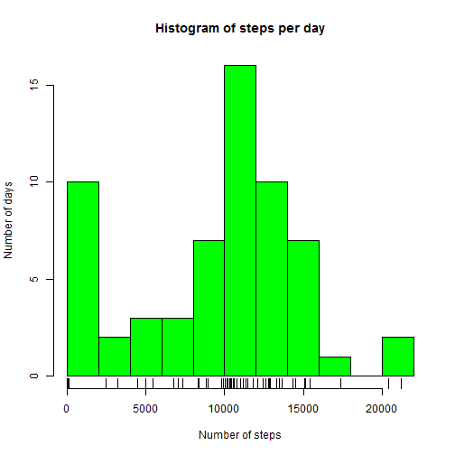
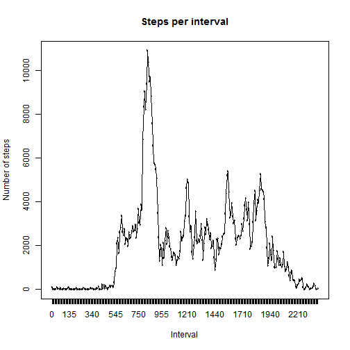
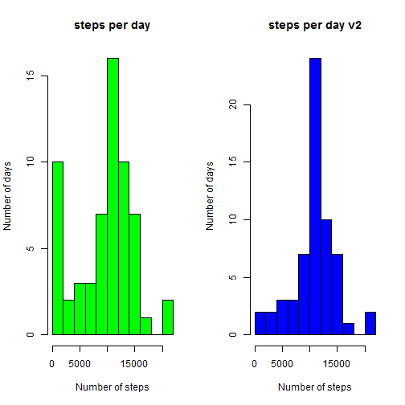
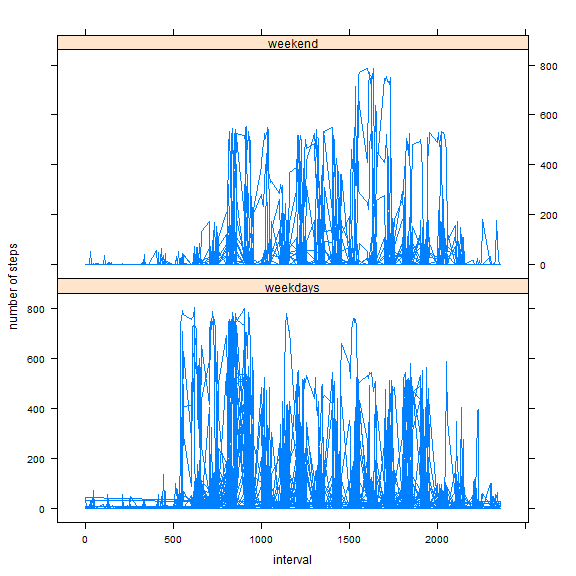

   
   
## Loading and preprocessing the data


First of all we will load our data, which is a text file in .csv format, so `read.csv()`command is invoked.


```r
raw.data <- read.csv("activity.csv")
```
We can see in the structure

```r
str(raw.data)
```

```
## 'data.frame':	17568 obs. of  3 variables:
##  $ steps   : int  NA NA NA NA NA NA NA NA NA NA ...
##  $ date    : Factor w/ 61 levels "2012-10-01","2012-10-02",..: 1 1 1 1 1 1 1 1 1 1 ...
##  $ interval: int  0 5 10 15 20 25 30 35 40 45 ...
```
and the summary of data 

```r
summary(raw.data)
```

```
##      steps                date          interval     
##  Min.   :  0.00   2012-10-01:  288   Min.   :   0.0  
##  1st Qu.:  0.00   2012-10-02:  288   1st Qu.: 588.8  
##  Median :  0.00   2012-10-03:  288   Median :1177.5  
##  Mean   : 37.38   2012-10-04:  288   Mean   :1177.5  
##  3rd Qu.: 12.00   2012-10-05:  288   3rd Qu.:1766.2  
##  Max.   :806.00   2012-10-06:  288   Max.   :2355.0  
##  NA's   :2304     (Other)   :15840
```
  
### Process/transform the data (if necessary) into a format suitable for your analysis
Let's see start of data 

```r
head(raw.data,10)
```

```
##    steps       date interval
## 1     NA 2012-10-01        0
## 2     NA 2012-10-01        5
## 3     NA 2012-10-01       10
## 4     NA 2012-10-01       15
## 5     NA 2012-10-01       20
## 6     NA 2012-10-01       25
## 7     NA 2012-10-01       30
## 8     NA 2012-10-01       35
## 9     NA 2012-10-01       40
## 10    NA 2012-10-01       45
```
and in the end of data 

```r
tail(raw.data,10)
```

```
##       steps       date interval
## 17559    NA 2012-11-30     2310
## 17560    NA 2012-11-30     2315
## 17561    NA 2012-11-30     2320
## 17562    NA 2012-11-30     2325
## 17563    NA 2012-11-30     2330
## 17564    NA 2012-11-30     2335
## 17565    NA 2012-11-30     2340
## 17566    NA 2012-11-30     2345
## 17567    NA 2012-11-30     2350
## 17568    NA 2012-11-30     2355
```
It is not necessary to transform: **we have tidy data**  

* one column per variable, 
* one row per observation, 
* variable names are comprehensible, and one table for every kind of data (1).  


## What is mean total number of steps taken per day?
### 1.- Calculate the total number of steps taken per day
First we aggregate steps per day with dplyr library, calculate sum per day

```r
require(dplyr)
steps.day <- raw.data %>% group_by(date) %>% summarize(total_steps = sum(steps,na.rm=TRUE))
```

### 2.- Make a histogram of the total number of steps taken each day
We can use aggregated values in past step

```r
plot.new()
hist(steps.day$total_steps, breaks = 10, main="Histogram of steps per day", xlab="Number of steps", ylab = "Number of days", col="green")
rug(steps.day$total_steps)
```

 

### 3.- Calculate and report the mean and median of the total number of steps taken per day
We can use aggregated values in first step

```r
smean <- mean(steps.day$total_steps)
smedian <- median(steps.day$total_steps)
```
Mean is **9354.2295082**, and median is **10395**.

## What is the average daily activity pattern?
### 1.- Make a time series plot of the 5-minute interval (x-axis) and the average number of steps taken, averaged across all days (y-axis)
In first step we aggregate data grouped by interval. It is necessary to convert interval to factor.

```r
steps.interval <- raw.data %>% 
  mutate(interval_f = as.factor(interval)) %>%
  group_by(interval_f) %>% 
  summarize(tot_steps = sum(steps,na.rm = TRUE))
```
Then we can plot

```r
plot.new()
plot(steps.interval,main="Steps per interval", xlab = "Interval", ylab="Number of steps")
lines(steps.interval$tot_steps ~ steps.interval$interval)
```

 


### 2.- Which 5-minute interval, on average across all the days in the dataset, contains the maximum number of steps?
Using the aggregated data frame per interval, we access by command `which.max()`

```r
steps.interval[which.max(steps.interval$tot_steps),]
```

```
## Source: local data frame [1 x 2]
## 
##   interval_f tot_steps
##       (fctr)     (int)
## 1        835     10927
```


## Imputing missing values
### 1.- Calculate and report the total number of missing values in the dataset (i.e. the total number of rows with NAs)
Counting Not available values in data, we can see all of them are in 'steps' variable.

```r
colSums(is.na(raw.data))
```

```
##    steps     date interval 
##     2304        0        0
```


### 2.- Devise a strategy for filling in all of the missing values in the dataset. 
We'll use the mean of each interval to fill observations with `NA` steps.  

1. we calculate a reference data frame with median of each interval for all dates, without missing values.   
2. process the original data frame in a for loop to substitute NA values for an interval with median 


### 3.- Create a new dataset that is equal to the original dataset but with the missing data filled in.
Calculate reference

```r
steps.mean <- raw.data %>% 
  mutate(interval_f = as.factor(interval)) %>%
  group_by(interval_f) %>% 
  summarize(mean = mean(steps,na.rm = TRUE))
```
Process original data in a new dataset

```r
fd <- raw.data
for (i in 1:nrow(fd)){
  if (!is.na(fd[i,"steps"]) )
    next()
  int <- fd[i,"interval"]
  fd[i,"steps"] <- steps.mean[steps.mean$interval_f==int,"mean"]
}
```


### 4.- Make a histogram of the total number of steps taken each day and Calculate and report the mean and median total number of steps taken per day. 


First aggregate steps per day

```r
steps.day.2 <- fd %>% group_by(date) %>% summarize(total_steps = sum(steps,na.rm=TRUE))
```
Then make the histogram

```r
plot.new()
par(mfrow=c(1,2))
hist(steps.day$total_steps, breaks = 10, main="steps per day", xlab="Number of steps", ylab = "Number of days", col="green")
hist(steps.day.2$total_steps, breaks = 10, main="steps per day v2", xlab="Number of steps", ylab = "Number of days", col="blue")
```

 


Do these values differ from the estimates from the first part of the assignment? What is the impact of imputing missing data on the estimates of the total daily number of steps?
- The answer is **yes**, if we compare both histograms, we see less frecuency in days with zero steps, and more days with more than 10.000 steps.


Mean increases

```r
smean
```

```
## [1] 9354.23
```

```r
mean(steps.day.2$total_steps)
```

```
## [1] 10766.19
```

Median also grows

```r
smedian
```

```
## [1] 10395
```

```r
median(steps.day.2$total_steps)
```

```
## [1] 10766.19
```


## Are there differences in activity patterns between weekdays and weekends?

First we create the new variable on the original data set

```r
require(lubridate)
Sys.setlocale("LC_TIME", "english") 
```

```
## [1] "English_United States.1252"
```

```r
week.data <- raw.data %>% 
  mutate(weekday = weekdays(ymd(raw.data$date))) %>%
  mutate(is.weekend = ifelse(weekday=="Saturday" | weekday=="Sunday","weekend","weekdays"))
```
And we plot with lattice

```r
require(lattice)
xyplot(week.data$steps~week.data$interval | week.data$is.weekend, 
       layout=c(1,2),type="l",
       xlab="interval", ylab = "number of steps")
```

 

The answer is **yes**: the subject takes more steps in the intervals between 500 and 1000, and in weekends, does more exercise in intervals 1500 to 1800. 

